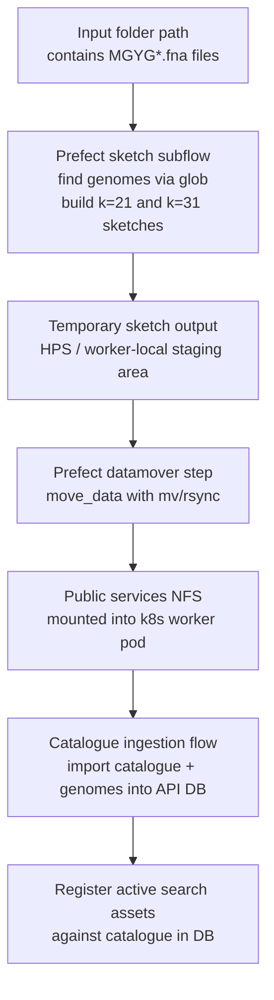

# Sourmash Search Architecture and Implementation Plan

## Decision summary

Roll sourmash **search** into the main MGnify APIv2 codebase and run the expensive work via Django Tasks, rather than keeping a separate sourmash search microservice.

This fits the current reality better:

- The API DB is already the source of truth for catalogues, versions, genomes, and metadata.
- Search results are enriched from the main DB anyway.
- Keeping sourmash as a separate service creates avoidable drift around "which catalogues are searchable right now".
- A DB-backed task queue is a reasonable trade-off at MGnify's current expected search volume.

The resulting shape is not "microservice talks to API", but "one application image with two runtime roles":

- `gunicorn` / API role: accepts requests, validates catalogues, enqueues tasks, returns task IDs, polls task results, enriches hits with MGnify metadata.
- `db_worker` role: executes sourmash search tasks against mounted sketch files.

## Important compatibility note

This repository currently pins Django `5.2.7` in [requirements.txt](/Users/mahfouz/Code/mgnify-web/emgapi-v2/requirements.txt), while Django's built-in Tasks framework is new in Django 6.0.

That means the near-term implementation should be:

- add the `django-tasks` backport package
- add `django-tasks-db`
- use `python manage.py db_worker` for the worker role

This keeps the design aligned with the Django 6 Tasks API, while remaining compatible with the current application stack. Once the project upgrades to Django 6+, the code can move off the backport with minimal application-level changes.

## Proposed architecture

```mermaid
flowchart LR
    client["Client / Web UI / API consumer"]
    api["MGnify APIv2 web pod\nDjango + Ninja + Gunicorn"]
    db["Postgres\nMGnify DB + task queue + task results"]
    worker["MGnify APIv2 worker pod\npython manage.py db_worker"]
    sketches["Mounted sketch store\n/nfs/public/services/..."]
    meta["GenomeCatalogue + Genome metadata\nsame MGnify DB"]

    client -->|POST search request| api
    api -->|validate catalogue ids\nand build task payload| meta
    api -->|enqueue task| db
    api -->|202 Accepted\n{task_id, poll_url}| client

    worker -->|claim queued task| db
    worker -->|load active sketch paths| meta
    worker -->|read .sig / manifest files| sketches
    worker -->|write task status/result| db

    client -->|GET task status/result| api
    api -->|read task result| db
    api -->|enrich genome accessions| meta
    api -->|status / annotated result| client
```

### Search-side design choices

- The authoritative catalogue list should come from the MGnify DB, not from a separate sourmash settings file.
- The worker should return a small normalized result payload, such as accession IDs plus overlap metrics, and let the API layer do the final metadata enrichment.
- Task arguments and results must stay JSON-serializable. Pass catalogue IDs, thresholds, k-mer size, query text, staged query file paths, and result summaries; do not pass model instances or open file handles.
- If a request enqueues a task after creating DB records, enqueue it inside `transaction.on_commit(...)` so the worker never races ahead of the database commit.

## Sketch build and catalogue ingestion flow



### Ingestion-side design choices

- Keep the sketch flow folder-based, not `GenomeCatalogue`-object-based, so sketches can be built before DB ingestion starts.
- Make the sketch flow a subflow of catalogue ingestion, but allow it to run independently for pre-staging.
- Treat "catalogue is searchable" as an explicit state transition after the artefacts are present in the mounted public-services location and registered in the DB.
- This same pattern can later back Branchwater: shared DB metadata, filesystem artefacts, API enqueue/poll endpoints, and a dedicated worker runtime.

## Recommended data model

To prevent filesystem state and DB state from drifting apart, add a small DB-backed registry for search artefacts instead of relying on ad hoc settings constants.

Recommended model: `GenomeSearchIndex` in the `genomes` app.

Suggested fields:

- `catalogue` -> `ForeignKey(GenomeCatalogue)`
- `backend` -> enum such as `sourmash`, later `branchwater`
- `ksize` -> integer
- `molecule_type` -> `DNA`
- `scaled` -> integer if relevant to the sketch format
- `artifact_path` -> mounted absolute path used by the worker
- `manifest_path` -> optional manifest of included genomes
- `genome_count` -> integer
- `built_at` -> datetime
- `is_active` -> boolean
- `checksum` -> optional integrity marker

Why this helps:

- The API can validate `catalogues_filter` against active indexed artefacts.
- The worker can discover the exact file to search without a separate config map.
- Ingestion can atomically switch a catalogue from not-searchable to searchable.
- The same model can support multiple backends and multiple k-sizes later.

If a smaller first iteration is needed, an abbreviated version of this state could live in a JSON field on `GenomeCatalogue`, but a dedicated model is the cleaner long-term shape.

## API shape

The current synchronous genome-search controller in [emgapiv2/api/genome_search.py](/Users/mahfouz/Code/mgnify-web/emgapi-v2/emgapiv2/api/genome_search.py) already shows the right enrichment pattern: backend-style raw hits are converted into MGnify-aware response objects. The sourmash version should keep that split, but make the execution asynchronous.

Recommended endpoints:

1. `POST /genome-search/sourmash/`
   Returns `202 Accepted` with:
   - `task_id`
   - `status`
   - `poll_url`
   - optional `expires_at`

2. `GET /genome-search/sourmash/{task_id}`
   Returns:
   - `PENDING`, `RUNNING`, `SUCCESS`, `FAILED`, or `NO_RESULTS`
   - final result payload once complete
   - structured error details for failures

3. Optional: `GET /genome-search/sourmash/{task_id}/download`
   Returns the raw CSV if preserving the current sourmash CSV output remains useful.

### Suggested request flow

- Accept either sequence text or uploaded FASTA, matching the current mixed JSON/multipart handling approach.
- Validate requested catalogue IDs against active `GenomeSearchIndex` rows.
- Stage uploaded query content somewhere durable and short-lived if the worker cannot consume the raw request body directly.
- Enqueue a search task carrying only JSON-safe values.
- Poll by `task_id`.
- When the task completes, enrich genome accessions from `Genome` / `GenomeCatalogue` ORM data before returning the final API response.

## Sourmash task design

The existing Celery task from `sourmash-queue` should be ported into a normal Django task module, probably in the `genomes` app or a small `search` module inside `emgapiv2`.

Recommended task responsibilities:

- Resolve the requested catalogue(s) to active sketch artefacts in the DB.
- Load the query signature or build it from a staged FASTA input.
- Run sourmash gather/search using a cleaned-up adaptation of the current `run_gather` logic.
- Normalize results into a stable API-facing schema.
- Write any large raw artefacts, such as CSV output, to a controlled results directory if needed.

Recommended non-responsibilities:

- Do not reach into unrelated API internals for metadata enrichment.
- Do not own the authoritative catalogue list.
- Do not embed environment-specific path maps directly in Python code.

## Implementation plan

### Phase 0: enable the task framework

Repo touch points:

- [requirements.txt](/Users/mahfouz/Code/mgnify-web/emgapi-v2/requirements.txt)
- [emgapiv2/settings.py](/Users/mahfouz/Code/mgnify-web/emgapi-v2/emgapiv2/settings.py)
- [emgapiv2/config.py](/Users/mahfouz/Code/mgnify-web/emgapi-v2/emgapiv2/config.py)

Tasks:

- Add `django-tasks`, `django-tasks-db`, and `sourmash` dependencies.
- Add `django_tasks_db` to `INSTALLED_APPS`.
- Configure `TASKS` settings.
- Add a dedicated `SourmashConfig` section to `EMGConfig` for sketch roots, query staging dir, raw result dir, supported k-sizes, and retention windows.
- Decide test/dev defaults:
  - `ImmediateBackend` in unit tests for simplicity
  - `django_tasks_db.DatabaseBackend` in local/dev/prod where worker processes exist

### Phase 1: add a DB registry for searchable artefacts

Repo touch points:

- `genomes/models/`
- `genomes/admin/`
- `genomes/migrations/`
- `genomes/tests/`

Tasks:

- Add `GenomeSearchIndex` model.
- Add admin visibility so operators can inspect active/inactive artefacts.
- Add tests around catalogue validation and active-index selection.

### Phase 2: port the sourmash worker logic

Repo touch points:

- new module such as `genomes/tasks.py` or `emgapiv2/search/tasks.py`
- new helper module for sourmash-specific filesystem and result formatting
- tests alongside the task code

Tasks:

- Port the current `run_gather` behavior out of Celery.
- Replace settings constants with `EMG_CONFIG` and DB lookups.
- Return a normalized result object that the API can safely expose.
- Keep optional CSV writing behind a helper so the core task result stays small.

### Phase 3: add enqueue and poll endpoints

Repo touch points:

- [emgapiv2/api/genome_search.py](/Users/mahfouz/Code/mgnify-web/emgapi-v2/emgapiv2/api/genome_search.py)
- [emgapiv2/api/__init__.py](/Users/mahfouz/Code/mgnify-web/emgapi-v2/emgapiv2/api/__init__.py)
- `emgapiv2/api/tests/`

Tasks:

- Add `POST` enqueue endpoint.
- Add `GET` poll endpoint.
- Reuse the existing result-annotation pattern for ORM enrichment.
- Decide whether to keep the current synchronous endpoint untouched or introduce a shared abstraction so COBS and sourmash can present similar response shapes.

### Phase 4: add the worker runtime

Repo touch points in this repo:

- [docker-compose.yaml](/Users/mahfouz/Code/mgnify-web/emgapi-v2/docker-compose.yaml)
- [Taskfile.yaml](/Users/mahfouz/Code/mgnify-web/emgapi-v2/Taskfile.yaml)
- [deployment/ebi-wp-k8s-hl/Dockerfile](/Users/mahfouz/Code/mgnify-web/emgapi-v2/deployment/ebi-wp-k8s-hl/Dockerfile)

Infra touch points likely live in the private deployment repo, but the local examples here show the pattern.

Tasks:

- Add a new compose service using the same app image but running `python manage.py db_worker`.
- Mount the same sketch/results volumes into that worker service.
- Add a separate k8s deployment or sidecar-like pod role using the same image and env as the API, but with `db_worker` as the command.
- Keep worker concurrency conservative at first so long-running searches do not compete too aggressively for CPU or DB connections.

### Phase 5: add the sketching Prefect flow

Repo touch points:

- new flow under `workflows/flows/`
- [workflows/flows/import_genomes_flow.py](/Users/mahfouz/Code/mgnify-web/emgapi-v2/workflows/flows/import_genomes_flow.py)
- `workflows/tests/`

Tasks:

- Add a flow that takes a `Path` and one or more `ksize` values.
- Use `glob` / `rglob` to find `MGYG*.fna` files a small number of directories deep.
- Build both `k=21` and `k=31` sketches as requested.
- Emit a manifest describing which genomes were included and where the artefacts were written.
- Make the flow callable both standalone and as a subflow from catalogue ingestion.

### Phase 6: move artefacts to mounted public storage

Repo touch points:

- [workflows/prefect_utils/datamovers.py](/Users/mahfouz/Code/mgnify-web/emgapi-v2/workflows/prefect_utils/datamovers.py)
- new or updated flow calling `move_data`

Tasks:

- Add a datamover step to move sketches from HPS or worker-local staging to `/nfs/public/services/...`.
- Prefer `rsync` or `mv` semantics depending on whether retries must be idempotent.
- Register the final mounted path in `GenomeSearchIndex` only after the move completes successfully.

### Phase 7: wire sketching into ingestion

Repo touch points:

- [workflows/flows/import_genomes_flow.py](/Users/mahfouz/Code/mgnify-web/emgapi-v2/workflows/flows/import_genomes_flow.py)
- supporting test files and fixtures

Tasks:

- Invoke the sketch flow as a subflow of catalogue ingestion.
- Reorder the workflow so catalogue search registration happens only when artefacts are ready.
- Keep the pre-ingestion standalone mode so large catalogues can be sketched before they become visible in the API.

### Phase 8: local development support

Repo touch points:

- [docker-compose.yaml](/Users/mahfouz/Code/mgnify-web/emgapi-v2/docker-compose.yaml)
- [Taskfile.yaml](/Users/mahfouz/Code/mgnify-web/emgapi-v2/Taskfile.yaml)
- fixtures under `slurm-dev-environment/fs/` or `genomes/fixtures/`

Tasks:

- Add a tiny dev catalogue with a few `MGYG*.fna` files.
- Ensure the sketch flow can run locally against those inputs.
- Mount a local search-artifact directory into both the API and worker containers.
- Extend the dev bootstrap path so `task run` plus the normal setup commands can exercise:
  - sketch generation
  - task enqueue/poll
  - worker execution
  - ORM metadata enrichment

Prefer generating tiny sketch artefacts during dev setup rather than committing large binary sketch outputs into Git.

### Phase 9: tests, observability, and rollout

Repo touch points:

- `emgapiv2/api/tests/`
- `genomes/tests/`
- `workflows/tests/`

Tasks:

- Add unit tests for catalogue-to-artefact resolution and task result normalization.
- Add API tests for enqueue, poll, failure, and no-result flows.
- Add a workflow test for the sketch subflow using tiny `.fna` fixtures.
- Add logging around:
  - task enqueue
  - worker claim/start/finish
  - artefact path resolution
  - sourmash runtime and hit counts
- Add a pruning command or scheduled cleanup for old task results and staged query files.

## Suggested response schema

Keep the final API response smaller and more stable than the raw sourmash internal objects. A reasonable shape is:

- task metadata
- query metadata
- per-hit accession and overlap metrics
- MGnify ORM-enriched genome details
- optional link to raw CSV artefact

This preserves room to swap out the sourmash internals later without changing the public API contract too much.

## Risks and mitigations

### 1. Django version mismatch

Risk:

- The architecture assumes Django Tasks, but the repo is still on Django 5.2.

Mitigation:

- Use `django-tasks` backport now.
- Keep the task API close to Django 6's built-in shape so the later upgrade is mostly dependency/config work.

### 2. Queue growth in Postgres

Risk:

- Completed task rows and raw result artefacts will accumulate.

Mitigation:

- Set explicit retention and pruning for task results, staged uploads, and CSV outputs.
- Keep the result payload small.

### 3. CPU-heavy search work impacting the API

Risk:

- If API and worker share the same deployment or resource pool too closely, search jobs can starve normal requests.

Mitigation:

- Separate API and worker runtime roles.
- Set explicit CPU/memory requests and low initial worker concurrency.

### 4. Catalogue/search drift

Risk:

- Filesystem artefacts exist but are not registered, or DB rows claim an artefact that has not been moved yet.

Mitigation:

- Register search artefacts in the DB only after the datamover step succeeds.
- Make "searchable" an explicit state in the DB.

### 5. Large query payload handling

Risk:

- Uploaded FASTA content may not be practical to pass directly in task payloads.

Mitigation:

- Stage uploads to a short-lived query directory and pass only the staged path into the task.

## Recommended first delivery slice

Build the smallest end-to-end vertical slice first:

1. Add `django-tasks` + `django-tasks-db`.
2. Add `GenomeSearchIndex`.
3. Add one sourmash task that searches a single catalogue and returns a small JSON result.
4. Add `POST` enqueue and `GET` poll endpoints.
5. Add a `db_worker` service to local `docker-compose`.
6. Add tiny local test data and prove the full flow under local development.

After that works, layer in:

- multi-catalogue support
- CSV/raw artefact output
- Prefect sketch subflow
- datamover registration
- ingestion integration
- branchwater reuse

## External references

- Django Tasks docs: [https://docs.djangoproject.com/en/6.0/topics/tasks/](https://docs.djangoproject.com/en/6.0/topics/tasks/)
- `django-tasks-db`: [https://github.com/RealOrangeOne/django-tasks-db](https://github.com/RealOrangeOne/django-tasks-db)
