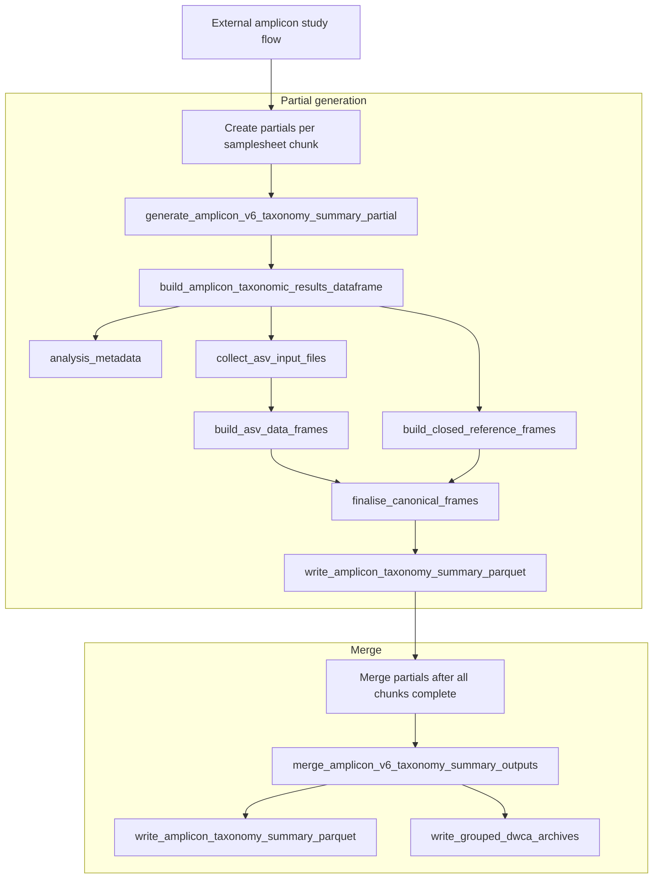
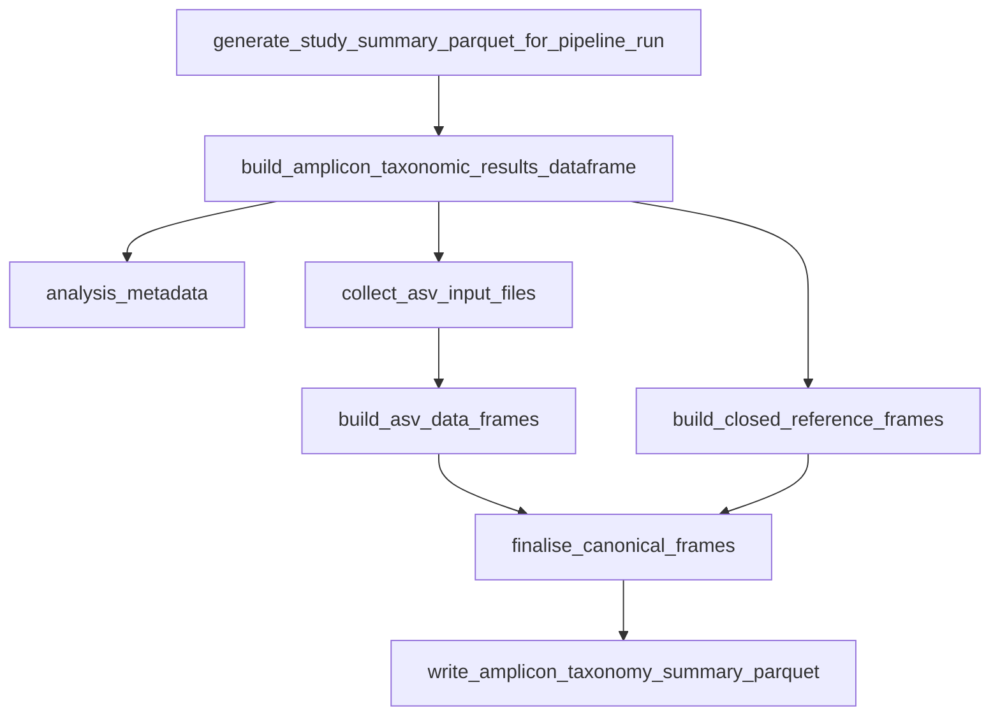

# Amplicon v6 study summaries

This directory builds study-level taxonomy summaries for v6-family amplicon analyses.
The summary is generated from imported `Analysis` records and their registered
downloads.

## Inputs

`study_summary_parquet.py` expects each analysis to have the following analysis downloads for:

- ASV FASTA sequences: `asv.sequences`
- ASV read counts: `asv.distribution`, ending `_asv_read_counts.tsv`
- ASV taxonomy tables: `asv.distribution`, one per DADA2 database and sometimes per amplified region
- ASV MAPseq files: `taxonomies.asv.<database>`, ending `.mseq`
- closed-reference taxonomy TSVs: `taxonomies.closed_reference.<database>`, ending `.tsv`

Missing ASV or closed-reference inputs are skipped per database where possible.
Duplicate downloads for inputs that should be unique fail the summary generation
because the code cannot choose a correct file safely.

## Dataframe

All parsers convert the pipeline outputs into the schema in
`workflows/flows/analysis/summaries/amplicon/shared/schema.py`.

The dataframe contains:

- study, analysis, sample, run, and pipeline metadata
- selected ENA sample metadata flattened into public columns
- remaining sample metadata nested in `sample_metadata`
- taxonomy rank columns in snake case
- measurement fields for read counts
- ASV-specific fields where applicable

ASV rows use `analysis_method = "asv"`.
Closed-reference rows use `analysis_method = "closed_reference"`.

## Identifiers

`event_id` is a readable stable key:

```text
<study_accession>:<sample_accession>:<run_accession>:<pipeline_version>
```

`event_guid` and `occurrence_id` are UUIDv5 values generated from row
components. They should remain stable for the same biological event or occurrence
across repeated summary generations.

## Outputs

There are two generation paths.

The main production study flow creates one partial parquet file per samplesheet
chunk. This is to accommodate large studies.

Partial generation writes internal parquet files to:

```text
<study pipeline dir>/summaries/partials/*_taxonomy.parquet
```

`analysis_amplicon_study()` calls `merge_amplicon_v6_taxonomy_summary_outputs()`
after all chunks have run. That task combines the partial files and writes public
outputs to the study pipeline directory:

- one parquet file containing all canonical taxonomy rows
- one ASV Darwin Core Archive per reference database and amplified region -- IN PROGRESS
- one closed-reference Darwin Core Archive per reference database -- IN PROGRESS

Partial parquet files are internal only and are not attached to the Analysis as download files.

The standalone management command does not use partials. It builds the dataframe
directly from imported `Analysis` records and writes one parquet file into the
existing study `summaries` directory.

## Flows

### Partial generation

The partial generation flow is triggered by the `generate_amplicon_v6_taxonomy_summary_partial`
task.


### Whole study generation

Useful to regenerate summaries.


